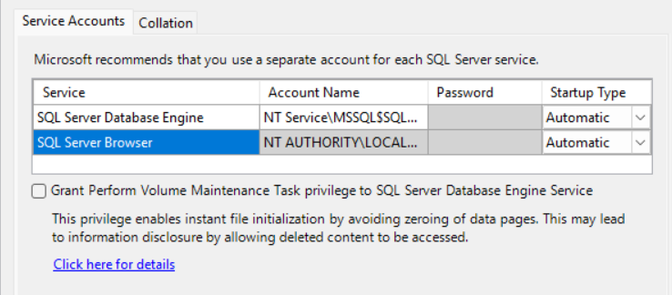
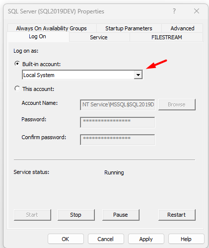
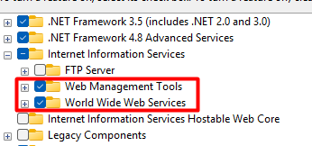
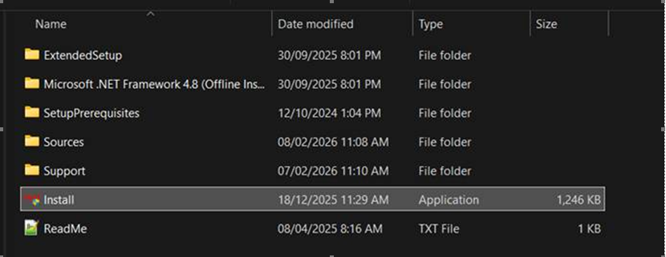
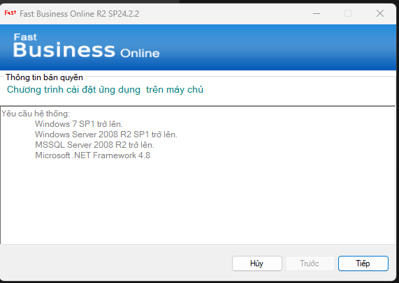
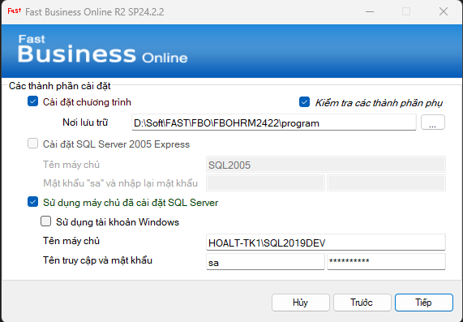
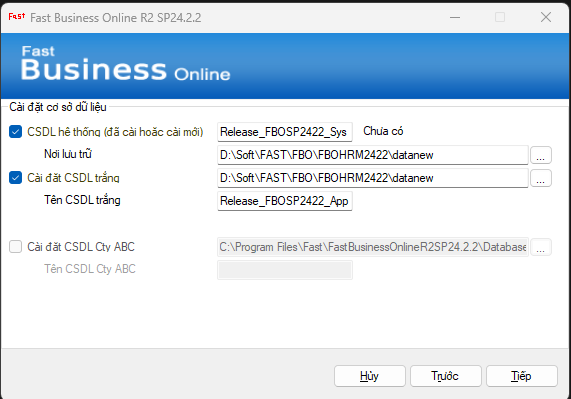
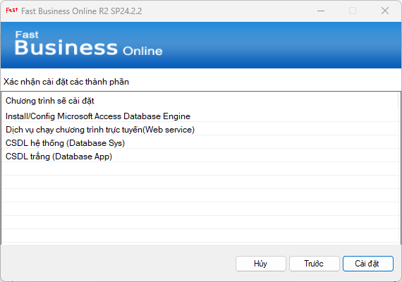

# FBO Installation Guide

## Fast Business Online

**Document for:** IT Department / IT Administrator  
**Version:** v0.1  
**Date:** May 2026  
**Status:** Final Markdown for IT/FAST review  
**Source:** `FBO installation.docx`

---

## 1. Document Control

| Item | Details |
| --- | --- |
| Document title | FBO Installation Guide |
| Product | FBO - Fast Business Online |
| Target audience | IT Department / IT Administrator |
| Document version | v0.1 |
| Document language | English |
| Source document | `FBO installation.docx` |
| Review status | Pending IT/FAST validation |

---

## 2. Purpose

This guide provides the IT installation steps for FBO (Fast Business Online). It explains the required software components, SQL Server configuration, IIS requirements, installer execution, database setup, and follow-up activities required before the application can operate.

---

## 3. Audience

This document is intended for IT personnel who are responsible for preparing the server environment and installing the FBO application.

The reader should have basic knowledge of:

- Windows Server administration.
- SQL Server installation and configuration.
- IIS configuration.
- Application installation on a server environment.

---

## 4. Scope

This guide covers:

- Required server components before installation.
- SQL Server and Windows feature prerequisites.
- Running the FBO installer provided by FAST.
- Configuring the program installation path.
- Connecting the installer to an existing SQL Server.
- Creating the system database and blank application database.
- Confirming the installation components.
- Notes on IIS website deployment and FAST license activation.

This guide does not cover:

- Detailed SQL Server installation steps.
- Detailed IIS website binding, SSL certificate, DNS, or firewall configuration.
- FAST serial key and license issuance steps.
- Functional setup after license activation.

---

## 5. System Requirements

The source installation guide identifies the following minimum components.

| Component | Requirement |
| --- | --- |
| SQL Server | SQL Server 2014 or later |
| SQL Server collation | `SQL_Latin1_General_CP1_CI_AS` |
| SQL Server Browser | Startup Type must be `Automatic` |
| SQL Server service account | Built-in account: `Local System` |
| .NET Framework | .NET Framework 3.5 and .NET Framework 4.8 |
| IIS | IIS must be enabled with the required features selected |
| Crystal Reports Runtime | Installed during the FBO installation process to support report/template viewing |

**Note:** The source screenshots also show FBO setup requirements including Windows 7 SP1 or later, Windows Server 2008 R2 SP1 or later, MSSQL Server 2008 R2 or later, and Microsoft .NET Framework 4.8. Confirm the officially supported operating system and database versions before production deployment.

---

## 6. Prerequisites

### 6.1 Configure SQL Server Services

**Description:**  
Before installing FBO, ensure that SQL Server services are configured correctly.

**Steps:**

1. Open SQL Server configuration or the SQL Server setup/service configuration screen.
2. Confirm that SQL Server Database Engine is installed.
3. Set SQL Server Browser `Startup Type` to `Automatic`.
4. Confirm that the Database Engine collation is `SQL_Latin1_General_CP1_CI_AS`.

**Expected result:**  
SQL Server is available for the FBO installer, and SQL Server Browser can start automatically.

### 6.2 Configure SQL Server Service Account

**Description:**  
The source guide indicates that the SQL Server service should use the built-in `Local System` account.

**Steps:**

1. Open the SQL Server service properties.
2. Go to the `Log On` tab.
3. Select `Built-in account`.
4. Select `Local System`.
5. Apply the configuration.
6. Restart the SQL Server service if required by the environment.

**Expected result:**  
The SQL Server service is configured to run under the `Local System` built-in account.

### 6.3 Enable .NET Framework and IIS Features

**Description:**  
FBO requires .NET Framework and IIS components to be enabled before installation.

**Steps:**

1. Open Windows Features or Server Manager.
2. Enable `.NET Framework 3.5`.
3. Enable `.NET Framework 4.8 Advanced Services`.
4. Enable Internet Information Services.
5. Ensure IIS `Web Management Tools` are selected.
6. Ensure IIS `World Wide Web Services` are selected.
7. Complete the Windows feature installation.

**Expected result:**  
The server has the required .NET Framework and IIS components enabled for FBO installation and website deployment.

---

## 7. Installation Package

### 7.1 Obtain the Installation Package

**Description:**  
The FBO installation package must be provided by FAST.

**Steps:**

1. Download or obtain the FBO installation package from FAST.
2. Extract or open the installation folder on the target server.
3. Locate the `Install` application file.

**Expected result:**  
The IT administrator can access the installer package and run the FBO installer.

---

## 8. Installation Procedure

### 8.1 Start the Installer

**Description:**  
Run the installer from the package provided by FAST.

**Steps:**

1. Right-click the `Install` application.
2. Run the installer with the required administrator permission.
3. Review the setup wizard information.
4. Click `Next`.

**Expected result:**  
The installer opens and proceeds to the component selection and configuration steps.

### 8.2 Select Installation Components and Program Path

**Description:**  
Select the FBO program installation option and define where the program files will be stored.

**Steps:**

1. Select the option to install the program.
2. Enter or browse to the program storage path.
3. Select the option to check required supporting components if available in the installer.
4. Confirm that the selected path has enough storage and appropriate access permission.

**Expected result:**  
The installer has the target location for FBO program files.

### 8.3 Configure SQL Server Connection

**Description:**  
Configure the installer to use an existing SQL Server.

**Steps:**

1. Select the option to use an installed SQL Server.
2. Enter the SQL Server name.
3. Enter the SQL Server login name and password if SQL authentication is used.
4. Click `Next`.

**Expected result:**  
The installer can connect to the SQL Server that will host the FBO databases.

**Note:** The source screenshot shows SQL login `sa` as an example. Use the authentication method and account approved for the target environment.

### 8.4 Configure Database Information

**Description:**  
Declare the database names and database storage paths required by FBO.

**Steps:**

1. Enter the system database name.
2. Enter the storage path for the system database.
3. Select the option to install a blank application database.
4. Enter the blank application database name.
5. Enter the storage path for the blank application database.
6. Click `Next`.

**Expected result:**  
The installer has the database names and storage locations required to create the FBO databases.

### 8.5 Confirm Installation

**Description:**  
Review and confirm the components that will be installed.

**Steps:**

1. Review the installation confirmation screen.
2. Confirm the components to be installed, including Microsoft Access Database Engine install/configuration, web service deployment/configuration, system database creation, and blank application database creation.
3. Click `Install`.
4. Wait for the installation process to complete.

**Expected result:**  
The installer installs the FBO program and creates the blank database environment.

---

## 9. Post-Installation Configuration

### 9.1 Crystal Reports Runtime

During installation, the program installs Crystal Reports Runtime to support viewing report and print templates.

**Expected result:**  
Crystal Reports Runtime is available for FBO reporting and print-template viewing.

### 9.2 IIS Website Deployment

After the installation process, FBO is installed as a website on IIS.

IT must provide or confirm the protocol required to run the application online. The source document does not specify whether the target protocol is HTTP or HTTPS.

**Items to confirm:**

- Website binding protocol.
- Host name or URL.
- Port.
- SSL/TLS certificate requirement.
- Firewall and network access rules.

### 9.3 Serial Key and License Activation

FBO requires a serial key and license before the application can operate.

FAST is responsible for performing the serial key and license steps.

---

## 10. Post-Installation Verification

After installation, IT should verify the following items.

| Verification Item | Expected Result |
| --- | --- |
| Program files | FBO program files are available in the selected installation path. |
| SQL Server connection | The installed application can connect to the configured SQL Server. |
| Databases | The system database and blank application database are created in the selected storage paths. |
| IIS website | The FBO website is created or configured in IIS. |
| Crystal Reports Runtime | Report/template viewing dependencies are installed. |
| License status | FAST has completed serial key and license activation before operational use. |

---

## 11. Troubleshooting

| Issue | Possible Cause | Recommended Action |
| --- | --- | --- |
| Installer cannot connect to SQL Server | SQL Server name, credentials, service status, or network access is incorrect. | Verify SQL Server service status, server name, credentials, and network access. |
| SQL Server Browser is not available | SQL Server Browser is disabled or not set to Automatic. | Set SQL Server Browser startup type to `Automatic` and start the service. |
| Database creation fails | Database path is invalid or the SQL account does not have sufficient permission. | Verify database storage path and SQL account permission. |
| FBO website cannot be accessed | IIS binding, protocol, port, firewall, or DNS is not configured. | Confirm IIS website binding and network access settings with IT. |
| Reports or print templates cannot be viewed | Crystal Reports Runtime is missing or not installed correctly. | Verify Crystal Reports Runtime installation. |
| Application cannot operate after installation | Serial key or license has not been issued or activated. | Coordinate with FAST to complete license activation. |

---

## 12. Known Limitations and Open Items

### 12.1 Assumptions

- The source document is the approved installation outline for version `v0.1` of this guide.
- The screenshots are examples and may contain environment-specific values.
- The final server protocol, URL, port, and SSL/TLS setup will be confirmed by IT.
- FAST will perform serial key and license activation after technical installation.

### 12.2 Open Items for IT/FAST Review

| ID | Open Item |
| --- | --- |
| Q-001 | Confirm the officially supported Windows Server versions for this FBO installation. |
| Q-002 | Confirm whether SQL Server Authentication, Windows Authentication, or both are supported during installation. |
| Q-003 | Confirm the protocol, host name, port, and SSL/TLS requirements for online access. |
| Q-004 | Confirm the official FBO installer package name and target version for this guide. |
| Q-005 | Confirm whether environment-specific values in screenshots must be masked before external distribution. |

---

## 13. Change History

| Version | Date | Updated By | Change Description |
| --- | --- | --- | --- |
| v0.1 | 2026-05-25 | BA Assistant | Created English installation guide from `FBO installation.docx` and formatted for IT review. |
